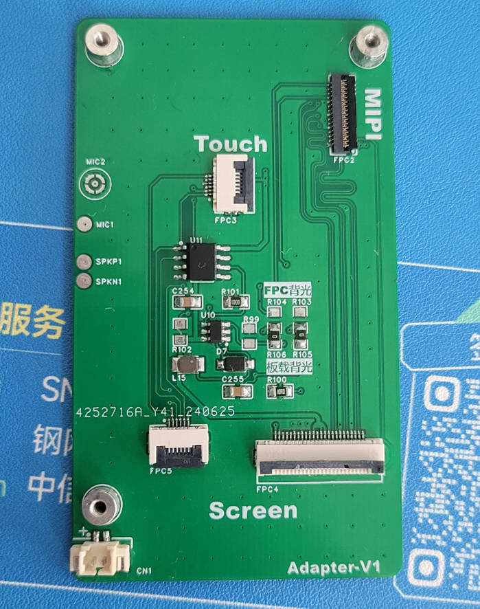

# 基于RK3566的个人终端

## 1. 项目简介

基于泰山派 RK3566 设计的简易个人终端设备，实现手机基本功能。

内置锂电池管理，加速度计，磁力计，EC20模块等。可烧录Android11/Ubuntu20.04 操作系统。

项目经过两版迭代。

## 2. 设计框架

## 3. 项目展示

|                        主控板 RK3566                        |                        扩展功能板-V2                         |
| :---------------------------------------------------------: | :----------------------------------------------------------: |
|  |  |

### V2-扩展资源

1. 扬声器、锂电池接口
2. CH224K PD供电，TP5100 锂电池管理
3. MIPI屏幕接口，TP触摸，按键
4. NS4150B 音频放大器
5. MPU6500 加速度传感器，AK8963C 三轴磁力计
6. MINI-PCIE 4G模块接口

|                         扩展板-V1                          |                          实物图                           |
| :--------------------------------------------------------: | :-------------------------------------------------------: |
|  |  |

### V1-扩展资源

1. 扬声器，喇叭接口
2. MIPI 接口，3.1寸触摸(IIC)
3. 背光调节 GP7101芯片
4. 背光驱动 SY7201

## 4. 文件说明

## 5. 资源链接

[泰山派手机综合项目](https://lceda001.feishu.cn/wiki/K51kwVQ9ViBTeDkYmsRc0YOLnle)

[3.1寸屏幕扩展板](https://oshwhub.com/fengmoxi/tai-shan-pai-3-1-cun-ping-mu-kuo-zhan-ban)

[泰山派底部4G_HUB2.0_ET100_HS扩展板](https://oshwhub.com/li-chuang-kai-fa-ban/tai-shan-pai-di-bu-4g_hub2-0_et100_hs-kuo-zhan-ban)
